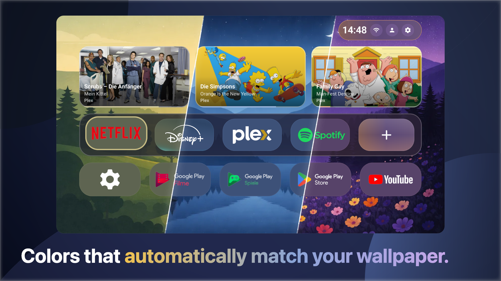

# Monet Launcher

Monet is an Android TV launcher with dynamic colors. The whole home screen is
themed from your wallpaper and recolors automatically when you change it.

This repository is only for distributing the APK. If the Play Store says your
device is "not compatible" (common on Ugoos, AOSP boxes and other non-certified
hardware), download the APK from the Releases page and install it manually.

 &nbsp; 

## Features

- Dynamic colors that match your wallpaper
- Wallpapers from several sources (your own images and videos, built-in, aerial, or Reddit), with auto-rotation, blur and brightness control
- Home screen widgets: clock and date, weather, now playing, and network/Bluetooth status
- Home rows you can show, hide and reorder: Continue Watching, Recommendations, Live TV, favorites, all apps, and HDMI inputs
- Set your own artwork per app, choose icon shapes, or use icon packs
- A favorites dock for the apps you use most
- Organize apps into folders, and rename, hide or uninstall them from the launcher
- Multiple user profiles
- Per-app PIN lock
- Screensaver with a custom image or video and an idle timeout
- Autostart on boot or after standby
- Theming: light or dark, accent and text colors, adjustable app size and grid
- Back up and restore your settings

## Requirements

- Android TV or Google TV device
- Android 8.0 (API 26) or newer

## Installation

1. Open the [Releases](https://github.com/Klevico/Monet-Launcher/releases) page and download the latest `monet-x.x.x.apk`.
2. On your TV, allow installs from unknown sources
   (Settings → Device Preferences → Security & restrictions → Unknown sources).
3. Install the APK with a file manager (X-plore, Send Files to TV, etc.) or over adb.

### Install over adb

    adb install monet-x.x.x.apk

If you're updating and get a signature error, remove the old build first:

    adb uninstall com.klevico.monet
    adb install monet-x.x.x.apk

## Notes

This is the official signed build. The source code is not part of this repository.
